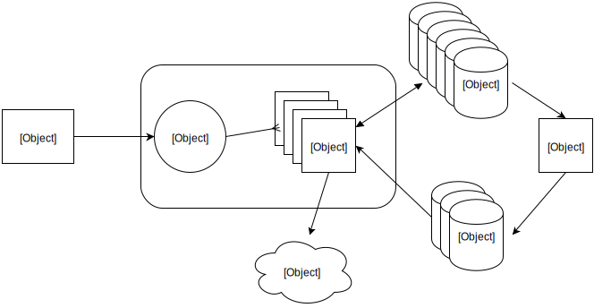

class: center, middle, inverse

## Building
# Server Side Cookies
## at
## Booking.com

---
## Overview

--

- Current setup

--

- Problems

--

- System overview

--

- Questions

---
## Cookies

--

- Cient-side data

--

- Maximum 4096 bytes

--

- Heavily compressed, schema'd user-specific data

---
## Sessions

--

- Server-side data

--

- Limited in size only by our hardware

--

- Perl-hashes that live in memcache

--

- ... that go away when memcaches dies or data expires

---
## Limitations: Cookies

--

- Linked to *device*, not a *user*

--

- We're running out of space

--

- Only access/modify during a pageview

---
## The Solution

--

- Server Side Cookies

--

- Persisent unstructued data indexed by Session-ID

--

- A platform for sharing unstructured data across devices: mobile apps, desktop, tablet

---
## The Constraints

--

- Time: 5ms/request average latency

--

- Storage: ~40TB over the next 2 years

--

- Horizontally scalable

--

- Fault tolerant

--

- Multi-DC support: failover and user migration

---
## Not a solution: memcache

--

- No persistence

--

- Server failure implies loss of _lots_ of data

--

- Where do we get 40TB of RAM?

---
## Not a solution: mysql

--

- Still too much data for RAM

--

- 5ms latencies mean we can't load it from disk

--

- Can't handle the write load

???

   - too much data for SSDs to be cost effective

   - we'd need ~83 masters with 7 disks each
   - no room to scale

---
## Not a solution: existing KV stores

--

- Existing solutions either optimized for writes or analytics

--

- Too slow for single-item retrieval

---
class: center, middle
## The Solution 

---
class: center, middle
## MongoDB

---
class: center, middle


---
class: center, middle
## Redis + MySQL

---
class: center, middle
## ... + ZeroMQ + C + lots of perl

---
## Why Redis

--

- Persistence

--

- Replication

--

- Structured values

---
## Why MySQL

--

- Because we're *really* good at MySQL operations

---
## Why ZeroMQ

--

- "My. Worst. Technical. Decision. Ever." -- *smueller*
- "ZeroMQ is a horribly leaky abstraction with propaganda as documentation." -- *nperez*

???

- Find one of us at lunch if you want to hear the full rant

---
class: center, middle



---

## Problems: the protocol

--

- Binary protocol for M04R 5p33d!!11

--

- Complex pack/unpack format strings

--

- utf8 vs. binary data

--

- heartbeats

???

   - hard to keep in sync
   - hard to construct by hand
   - insufficiently powerful language
   - strongly typed network protocol in a dynamically typed language
   - nperez's talk later today

---
## Problems: edge cases

--

- There are a lot of places something can go wrong

--

- And we have to handle all of them

--

- Timeouts, retries, failover

---
## Problems: bugs

--

- pack and ASCII strings with UTF8 flag don't play nicely together

--

- Algorithm::ConsistentHash::Ketama

???

FIXME: kill() doesn't have kill(2) semantics

---

##  A Single Request: SET_COOKIE

- Data Packet
  - header fields
  - version
  - cookie id
  - category
  - temporary
  - durable
  - data centers

```perl
my $pkt = pack("CCVv/avV/aV/aC/C", @args)```

---

class: center, middle


---

##  A Single Request: GET_COOKIE

- Data Packet
  - header fields
  - version
  - cookie id
  - data centers

```perl
my $pkt = pack("CCVv/aC/C", @args)```

---

class: center, middle


---

## Expiry

--

- Redis Expiry triggers zmq notification

  - github.com/tsee/redis

--

- expiry handler groups keys to reduce write load

--

- other logic including ditching the data (bots)

---
## Sharding

--

- Redis and MySQL both heavily sharded

--

- Consistent hashing

--

- We can add capacity with minimal downtime

???

- redis is sharded x18
- mysql is sharded x80

---


## Multi-DC support

--

- GET

  - If not found locally, ask remote DCs
  - If found locally, warm remote DCs (async)

--

- SET:
   - replicate to remote DCs (async)

???

consensus can't be done quickly
  -- we can't guarantee everybody has the data without slowing down
  -- multiple writes + responses from cross-dc
  -- so we send the packets and hope for the best

---
## Distributed systems are Hard

--

- Race Conditions

--

- Edge-cases

--

- Deploying "no-turning-back" systems


???

- can't force all requests to finish in order, whatever that means
- multiple concurrent requests


- too many edge cases will never show up in your test environment
  - load mismatch
  - network latency mismatch
  - lots of interacting systems
  - most reliable pieces of a system are the ones that aren't there
  - in production, there are more moving pieces

- shipping out broken cookies, and then having to deal with them

---

## How much code?

- ~9000 lines of Perl
   - ShardedKV
   - Reflexive::ZMQ 

- ~600 lines of C (broker)

- ~1000 lines of Go (testing)
    - github.com/dgryski/go-binpack
    - (+Sereal port)

???

having multiple implementations of protocols is useful

---

## Conclusion

- Distributed systems are hard

- Fast systems totally doable in Perl

- Don't use ZeroMQ

---

class: center, middle, inverse

## fin

???

vim: ft=markdown
